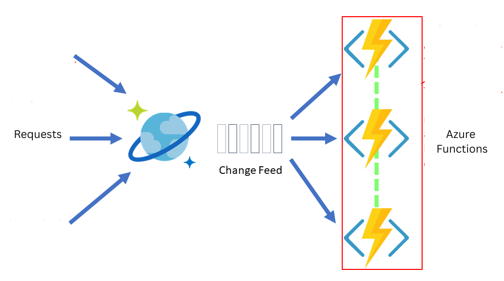

# Simplique-AzureDevops
# Cost Optimization Challenge: Managing Billing Records in Azure Serverless Architecture

## According to me, I have a few suggestions to reduce the cost.

### 1. Tagging Resources
We can implement tagging of the resources in the cosmosDB. This will give us the insights on which resources incurs the most cost among the others.

### 2. Eliminate Idle Resources
- We will identify resources that have been idle for extended periods.
- And then schedule cleanup processes to ensure safe deletion and cost savings.

### 3. VM Start/Stop Optimization
- Since we know users will be requesting for the data, we then identify the timeframe when there are no requests from the users and schedule a VM/App service Stop and Start to ensure the services are active only during necessary periods, effectively curbing idle expenses.
- Monitor user activity to detect periods of low or no usage.
- Automatically stop VM/App Services during these periods.
- Start them again during expected active hours.

#### Potential Risks
- There might be an instance when there can be a request in an unusual hour, to avoid this we can configure the notifications to the team that the VM has been stopped and a read/write was requested and once this mail is triggered, a script will run to start the service.
- To mitigate:
  - Set up Azure alerts to notify the team when a read/write request is made while VM is stopped.
  - Upon receiving the alert email, trigger a pipeline to start the service.

#### 🧪 Pseudo-code Outline
a. Stop the service 

b. Configure Azure alerts to notify the team upon request 

c. On alert email receipt, trigger a pipeline to start the service

### 4. Data Migration via Change Feed
- Use **Azure Change Feed** to migrate records older than 3 months to Azure Blob Storage with zero downtime.
- Post-migration, we can configure **Time To Live (TTL)** to delete outdated records from CosmosDB.
- We will be using the Azure function to read the change feeds and migrate a set of old records to the azure blob storage.
- We then can use Azure Blob Storage to service the cold/old records, mostly 3 months older records. 
- This will have no change in the existing read/write APIs for billing records, but an additional endpoint to look for older records using the key(Date Modified/Accessed) in the azure blob storage.

#### Migration Steps
- Configure **Azure Functions** to stream change feed data.
- Then, store cold data (>3 months old) in Blob Storage.
- Maintain current read/write API logic.
- Add a new endpoint for accessing older records using `Date Modified` or `Date Accessed`.

#### Performance Considerations
- To reduce latency to fetch old records, we can integrate:
  - **Azure CDN**
  - **Azure Cache for Redis**

---

## Summary
These strategies allow cost optimization without sacrificing performance or availability.

